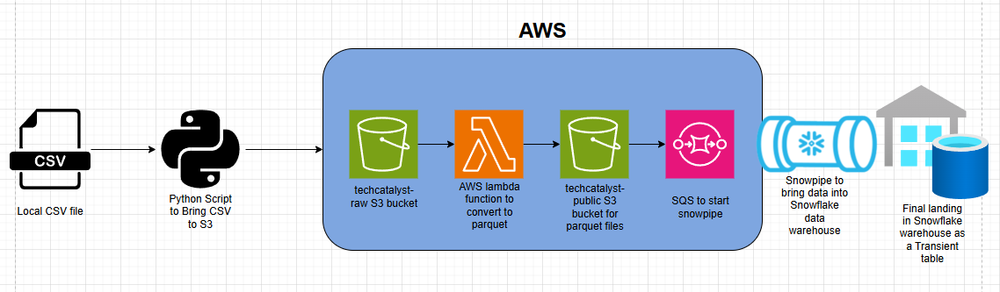

# Labs 1-5 Solution

## End to End Solution Diagram

## Use Cases
This solution can be used in instances where you have a constant stream of data in csv files that need to be accessed in your snowflake data warehouse. The pipeline works by taking csv files and every time a csv file is added to the `techcatalyst-raw` bucket, it triggers a lambda function to convert the file into a parquet file. This parquet file is then put into the `techcatalyst-public` bucket, from which the snowpipe is used to create this file as a transient table in the snowflake data warehouse. Therefore, if you would like to transform this data in snowflake after for further use, this pipeline would be very useful.